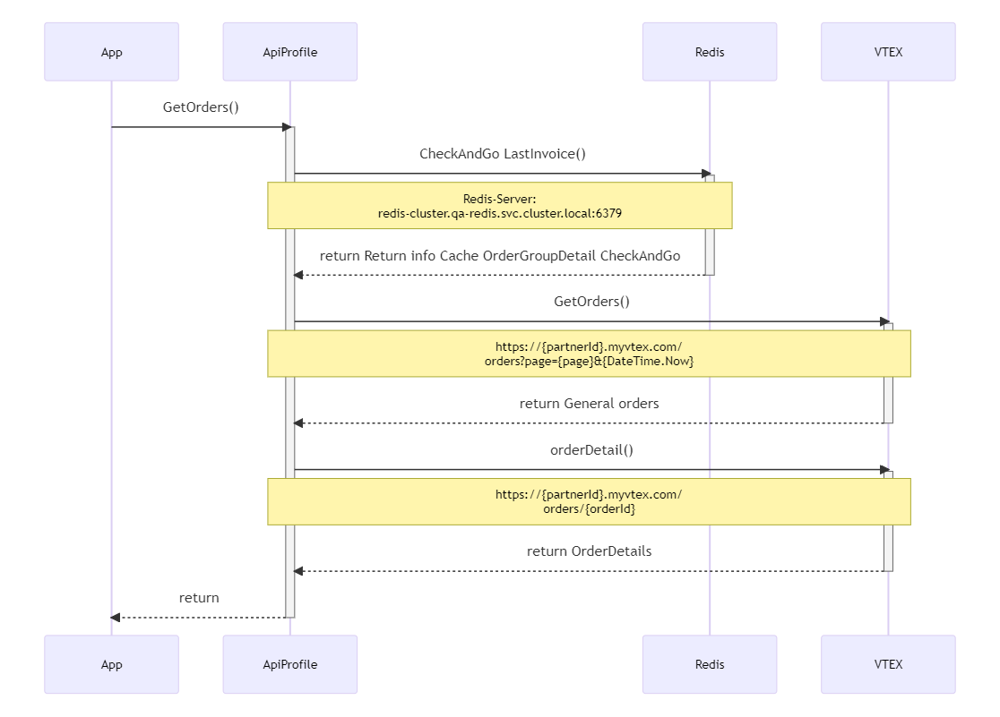
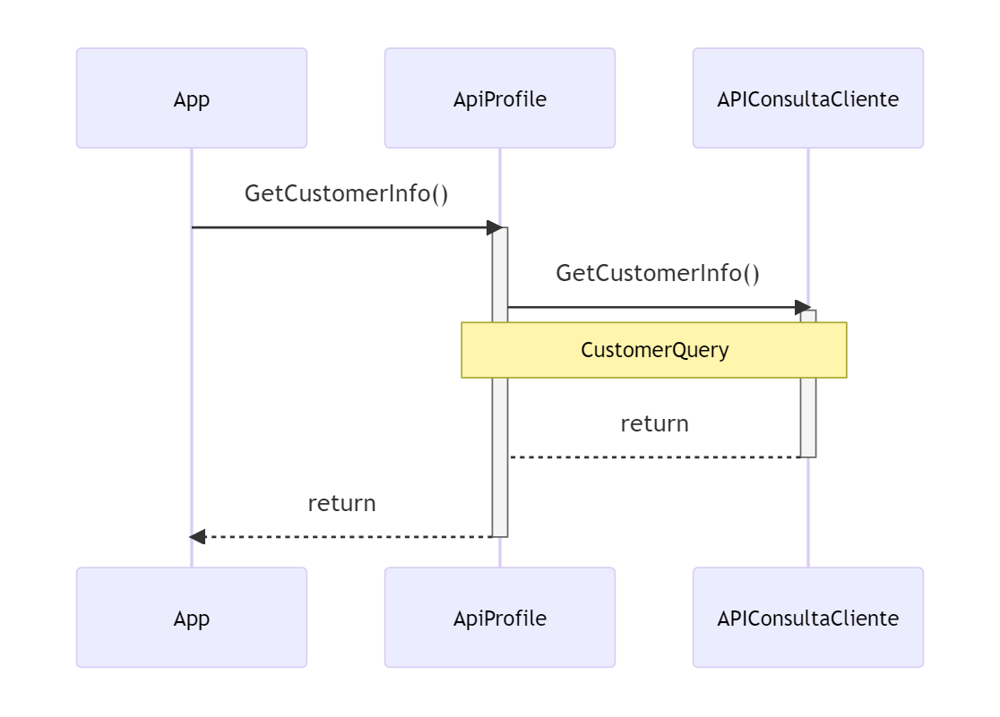
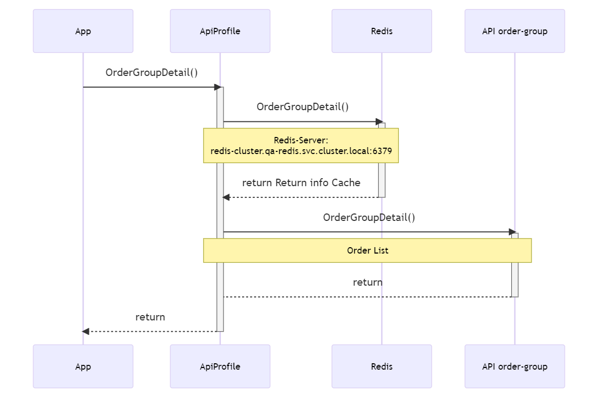

**NOMBRE DE LA INTEGRACIÓN O DEL API: PROFILE**

# Tabla de contenido

- [Descripción de la necesidad](#descripción-de-la-necesidad)
- [Pipelines](#pipelines)
- [Inventario de Artefactos](#inventario-de-artefactos)
- [Secuencia de ejecución de despliegue de Artefactos](#secuencia-de-ejecución-de-despliegue-de-artefactos)
- [Endpoints](#endpoints)
    - [Get Profile](#get-profile)
    - [Update User Data](#update-user-data)
    - [Get Addresses](#get-addresses)
    - [Create Address](#create-address)
    - [Set Guest Address](#set-guest-address)
    - [Update Address](#update-address)
    - [Delete Address](#delete-address)
    - [Get Payments](#get-payments)
    - [Validate Address Coverage](#validate-address-coverage)
    - [Get Orders](#get-orders)
    - [List Orders](#List-orders)
    - [Get Order Form Id](#get-order-form-id)
    - [Associate Order Form Id](#associate-order-form-id)
    - [Available Locations](#available-locations)
        - [Get available dependencies](#get-available-dependencies)
        - [Get cities Response](#get-cities-response)
        - [Get Dependencies Response](#get-dependencies-response)
    - [Associate Channel Id](#associate-channel-id)
    - [Order Detail](#order-detail)
        - [Pedido cancelado](#pedido-cancelado)
    - [Choose Address](#choose-address)
    - [Choose Buy And PickUp](#choose-buy-and-pickup)
    - [Change Commertial Policy](#change-commertial-policy)
    - [Query Puntos Colombia](#query-puntos-colombia)
    - [Get Carulla Segment](#get-carulla-segment)
    - [Save Date Login](#save-date-login)
    - [Save Acceptance Push](#save-acceptance-push)
    - [Get Acceptance Push](#get-acceptance-push)
    - [Get Customer Info](#get-customer-info)
    - [Order Group Detail](#order-group-detail)
	
	
# Descripción de la necesidad
Api Profile proporciona los servicios necesarios para administrar la información del cliente, datos personales como nombre, documento, género. 
Además, esta API brinda opciones para agregar una dirección con cobertura para la entrega o el modo de recogida en el punto de contacto. En general, un cliente puede ingresar su información y editarla cuando lo considere necesario.

# Pipelines

| Yaml            | Ruta             |
| --------------- | ---------------- |
| deployment.yaml | charts\templates |
| monitoring.yaml | charts\templates |
| service.yaml    | charts\templates |
| Chart.yaml      | charts           |
| values.yaml 	  | charts           |

El pipeline utiliza las siguientes librerias de variables:

- **Entorno de desarrollo**: dev-app-middleware-api-profile
- **Entorno de qa**: qa-app-middleware-api-profile
- **Entorno de uat**: uat-app-middleware-api-profile
- **Entorno de producción**: pdn-app-middleware-api-profile

| Variables                         | Descripción                                            |
| --------------------------------- | ------------------------------------------------------ |
|aplicacion                        |Hace referencia al pod dentro del espacio AKS, para estos casos se utiliza el mismo nombre del repositorio. |
|area_negocio                      | |
|area_ti                           | |
|ASPNETCORE_ENVIRONMENT            | |
|CodeCoverageFile                  |Hace referencia al archivo de configuración de pruebas unitarias, este archivo se encuentra dentro del directorio: src/GrupoExito.Middleware.xxx.UnitTest/coverlet.runsettings. Donde xxx = identificador del proyecto por ejemplo: profile, cart, sticker, etc.|
|CodeCoverageType                  |Hace referencia al tipo del archivo para guardar las pruebas unitarias, para estos casos sería: Xplat Code Coverage |
|containerPort                  |Hace referencia al puerto por donde se ejecuta el contenedor |
|cpulimits                         |Cantidad máxima de cpu que utilizará la aplicación dentro del pod de AKS, depende de la infraestructura. |
|feed                              |Hace referencia al grupo de librerías que utiliza el proyecto, para estos casos sería: ArtefactosNetCore |
|image.name                        |Nombre de la imagen para el contenedor docker, para estos casos es el mismo nombre del repositorio. |
|imagePullSecrets                  | |
|maxReplicas                       |Cantidad máxima de réplicas que se utiliza para escalamiento horizontal, depende de la infraestructura. |
|memorylimits                      |Cantidad máxima de memoria que utilizará la aplicación dentro del pod de AKS, depende de la infraestructura. |
|minReplicas                       |Cantidad mínima de réplicas que se utiliza para escalamiento horizontal, depende de la infraestructura. |
|name                              |Nombre con el que se va a identificar el api dentro del pod, para este caso será el mismo nombre del repositorio. |
|namespace                         |Espacio del AKS, para estos proyectos se usa apps |
|nombre                            |Nombre con el que se va a identificar el api dentro del pod, para este caso será el mismo nombre del repositorio. |
|pais                              | |
|port                              |Puerto donde escuchará la api, para este caso seria: 80 |
|pullPolicy                        | |
|SmokeTestContext                  |Hace referencia al tipo de test utilizado para las pruebas de humo. |
|sonar.project.key                 |Identificador del proyecto en sonar, para estos casos se usa el nombre de los repositorios. |
|sonar.project.name                |Nombre del proyecto en sonar, para estos casos se usa el nombre de los repositorios. |
|FormatCreationDate                |Para establecer la zona horaria de la fecha de creación de una orden en checkandgo |
|FormatCreationDateneckband        |Para establecer la zona horaria de la fecha de creación en el historial de tirillas de checkandgo |


La variable para el manejo del ELK para trazabilidad se encuentran almacenada como secreto bajo el nombre **configelk**

# Inventario de Artefactos

| **Tipo de artefacto** | **Nombre del artefacto**     			| **Descripción**                  |
| --------------------- | --------------------------- 			| ---------------------------------|
| Código fuente         | GIT/app-middleware-api-profile    	| Codigo fuente en .NET Core 3.1.  |
| Compilado             | Pipeline/app-middleware-api-profile   | Imagen Generada.       		   |

# Secuencia de ejecución de despliegue de Artefactos

| **Secuencia** | Tipo de artefacto                   | **Nombre del artefacto**    							 | **Servidor** | **Observaciones** |
| ------------- | ----------------------- 			  | --------------------------- 							 | ------------ | ------------------|
| 1             | Pipeline/app-middleware-api-profile | Ejecutar Pipeline y realizar aprobaciones segun entorno. | N/A 			| Ninguna 			|

# Endpoints

## Get Profile
Servicio que permite obtener el perfil del usuario en VTEX y adicionalmente valida si el usuario se encuentra registrado en CLIFRE


### Middleware

|**ENVIROMENT**| **ROUTE**																  |
|------		   |--		  																  |
|DEV		   | `https://wolframio.grupo-exito.com/apiex/app/v1/DAAHIBOWNVRP/getprofile` |
|QA            | `https://wolframio.grupo-exito.com/apiex/app/v1/XHDTTNKNEKIH/getProfile` |
|PROD          | `https://lawrencio.grupo-exito.com/apiex/app/v1/XHDTTNKNEKIH/getProfile` |

### Specifications

**Type:** GET

**Headers:** 
```
AuthorizationAPP: tokenMiddleware
partnerId: exito/carulla
Bearer Token: Token de Identity
```

**Response:**
```json
{
    "errors": [],
    "data": {
        "document": "8163442",
        "documentType": "C.C",
        "firstName": "Martin",
        "lastName": "Osorio",
        "fullName": "Martin Osorio",
        "cellPhone": "3186532286",
        "homePhone": "3186532286",
        "email": "martinjulianosorio@gmail.com",
        "birthDate": "1982-08-30T00:00:00Z",
        "dataComplete": true,
        "userInClifre": true,
        "gender": "male"
    }
}
```

- The field **dataComplete** indicates if the user has all data requiered registered
- The field **userInClifre** indicates if the user already exists in **CLIFRE**
- The field **segment** indicates the segment to which the user belongs in carulla

**Error**
```json 
{
    "errors":[
        {
            "code": "ERROR",
            "message": "ERROR: Se requiere el header AuthorizationAPP"
        }
    ],
    "data": {]
}
```

## Update User Data
Servicio que actualiza los datos del perfil de usuario en **VTEX** y adicionalmente valida si el usuario se encuentra registrado en **CLIFRE**, si el usuario no existe en **CLIFRE** entonces es creado.


### Middleware

|**ENVIROMENT**| **ROUTE**																		|
|------		   |--		  																		|
|DEV		   | `https://wolframio.grupo-exito.com/apiex/app/v1/DAAHIBOWNVRP/updateuserdata` |
|QA            | `https://wolframio.grupo-exito.com/apiex/app/v1/XHDTTNKNEKIH/updateuserdata` |
|PROD          | `https://lawrencio.grupo-exito.com/apiex/app/v1/XHDTTNKNEKIH/updateuserdata` |

### Specifications

**Type:** PUT

**Headers:** 
```
AuthorizationAPP: tokenMiddleware
partnerId: exito/carulla
Bearer Token: Token de Identity
```

**Body**
```json 
{
    "orderFormId": "0dcaf94712f5403cb9fdd77a37b9c35e",
    "ipSource": "120.1.1.1",
    "version": "URL TERMS",
    "versionHabeasData":"https://AppPolicy.exito.com/HabeasDataV2",
    "updateGender":false,
    "profile": {
        "email": "cristian.caro@pragma.com.co",
        "firstName": "Cristian",
        "lastName": "Caro",
        "document": "7747733",
        "documentType":"C.C",
        "birthDate": "1990-10-08",
        "gender": "male",
        "homePhone": "3007516408",
        "cellPhone":"3007516408",
        "businessPhone": "3007516408",
        "corporateName": null,
        "corporateDocument": null,
        "stateRegistration": null,
        "isCorporate": false
    }
}
```

The fields **"ipSource"** and **"version"** are mandatory to accept the terms and conditions, if you only want to update the user's information, these fields must be empty

**Response**
```json 
{
    "errors": [],
    "data": {
        "document": "8163442",
        "documentType": "C.C",
        "firstName": "Martin",
        "lastName": "Osorio",
        "fullName": "Martin Osorio",
        "cellPhone": "3186532286",
        "homePhone": "+573186532286",
        "email": "martinjulianosorio@gmail.com",
        "birthDate": "1982-08-30T00:00:00Z",
        "dataComplete": true,
        "userInClifre": false,
        "gender": "male"
    }
}
```
The field **dataComplete** indicates if the user has all data requiered registered

The field **userInClifre** indicates if the user already exists in **CLIFRE**

**Error**
```json 
{
    "errors":[
        {
            "code": "ERROR",
            "message": "ERROR: Se requiere el header partnerId"
        }
    ],
    "data": {]
}
```

## Get Addresses
Servicio que obtiene las direcciones de un usuario en **VTEX**


### Middleware

|**ENVIROMENT**| **ROUTE**																		|
|------		   |--		  																		|
|DEV		   | `https://wolframio.grupo-exito.com/apiex/app/v1/DAAHIBOWNVRP/getaddresses` |
|QA            | `https://wolframio.grupo-exito.com/apiex/app/v1/XHDTTNKNEKIH/getaddresses` |
|PROD          | `https://lawrencio.grupo-exito.com/apiex/app/v1/XHDTTNKNEKIH/getaddresses` |

### Specifications

**Type:** GET

**Headers:** 
```
AuthorizationAPP: tokenMiddleware
partnerId: exito/carulla
Bearer Token: Token de Identity
```

**Parameters:**


|**Parameters**   | **VALUE** | **REQUIRED** |
|------|--|--|
|**orderFormId**| `OrderFormId` | TRUE |

**Example request:**
```
{UrlBase}?orderFormId=d1cfa0b2fbd247c7b0218b0ba57b6b5e
```

**Response:**
```json 
{
    "errors": [],
    "data": {
        "addresses": [
            {
                "addressName": "j5n1xsd0eo",
                "reference": null,
                "geoCoordinate": [
                    -75.5768051147461,
                    6.2539238929748544
                ],
                "isSelected": false,
                "receiverName": "Cristian Caro Develop 5",
                "complement": "Prueba Edicion",
                "neighborhood": "",
                "country": "COL",
                "state": "ANTIOQUIA",
                "number": null,
                "street": "Cr 50 N 32 - 51",
                "postalCode": "05001",
                "city": "Medellín",
                "addressType": "residential"
            },
            {
                "addressName": "ap6i2h12op",
                "reference": null,
                "geoCoordinate": [
                    -75.5768051147461,
                    6.2539238929748588
                ],
                "isSelected": false,
                "receiverName": "Cristian Caro Develop",
                "complement": "Prueba",
                "neighborhood": "",
                "country": "COL",
                "state": "ANTIOQUIA",
                "number": null,
                "street": "Cr 50 N 32 - 21",
                "postalCode": "05001",
                "city": "Medellín",
                "addressType": "residential"
            }
        ],
        "dependency": {
            "geoCoordinates": null,
            "complement": "Exito Bello",
            "neighborhood": null,
            "country": "COL",
            "state": "Antioquia",
            "number": null,
            "street": null,
            "postalCode": null,
            "city": "Medellín",
            "addressType": null
        }
    }
}
```

**NOTE:** If there isn't an address selected then the property dependency should have values, else if there is an address selected then that property should be null

**Error**
```json 
{
    "errors":[
        {
            "code": "ERROR",
            "message": "ERROR: Se requiere el header AuthorizationAPP"
        }
    ],
    "data": {]
}
```

## Create Address
Servicio que crea una nueva dirección de usuario en **VTEXT**


### Middleware

|**ENVIROMENT**| **ROUTE**																		|
|------		   |--		  																		|
|DEV		   | `https://wolframio.grupo-exito.com/apiex/app/v1/DAAHIBOWNVRP/setaddress` |
|QA            | `https://wolframio.grupo-exito.com/apiex/app/v1/XHDTTNKNEKIH/setaddress` |
|PROD          | `https://lawrencio.grupo-exito.com/apiex/app/v1/XHDTTNKNEKIH/setaddress` |

### Specifications

**Type:** POST

**Headers:** 
```
AuthorizationAPP: tokenMiddleware
partnerId: exito/carulla
Bearer Token: Token de Identity
```

**Body**
```json 
{
    "orderFormId": "0dcaf94712f5403cb9fdd77a37b9c35e",
    "address": {
        "receiverName": "Cristian Caro",
        "complement": "Tercer Piso",
        "neighborhood": "",
        "country": "COL",
        "state": "ANTIOQUIA",
        "number": null,
        "street": "Calle 71A# 47-72",
        "geoCoordinates": [
            -75.5768051147461,
            6.2539238929748535
        ],
        "postalCode": "05001",
        "city": "Medellín",
        "addressType": "residential"
    }
}
```

**Response**
```json 
{
    "errors": [],
    "data": [
        {
            "addressName": "ykdssajgb4k",
            "addressType": "residential",
            "city": "Medellín",
            "postalCode": "05001",
            "country": "COL",
            "geoCoordinate": null,
            "neighborhood": "",
            "state": "ANTIOQUIA",
            "number": null,
            "street": "Dirección nueva Ernesto",
            "receiverName": "Cristian Caro",
            "reference": null,
            "complement": "Prueba Creación Piso",
            "id": null
        },
        {
            "addressName": "o41jjgi78r",
            "addressType": "residential",
            "city": "Medellín",
            "postalCode": "05001",
            "country": "COL",
            "geoCoordinate": null,
            "neighborhood": "",
            "state": "ANTIOQUIA",
            "number": null,
            "street": "Dirección nueva Ernesto",
            "receiverName": "Cristian Caro",
            "reference": null,
            "complement": "Prueba Creación Piso",
            "id": null
        },
        {
            "addressName": "30x9ewpef",
            "addressType": "residential",
            "city": "Medellín",
            "postalCode": "05001",
            "country": "COL",
            "geoCoordinate": null,
            "neighborhood": "",
            "state": "ANTIOQUIA",
            "number": null,
            "street": "MI DIRECCION PRUEBA",
            "receiverName": "Cristian Caro",
            "reference": null,
            "complement": "Tercer Piso",
            "id": null
        }
    ]
}
```

**Nota:** Cuando el Departamento sea Cundinamarca se cambiará por Bogotá D.C. a través de este servicio.

```json 
{
    "errors": [],
    "data": [
        {
            "addressName": "mo050hyye2",
            "reference": null,
            "geoCoordinate": [
                -75.5768051147461,
                6.2539238929748535
            ],
            "isSelected": false,
            "receiverName": "Tín tín",
            "complement": "quinto Piso",
            "neighborhood": "",
            "country": "COL",
            "state": "Bogotá, D.C.",
            "number": null,
            "street": "Ac. 85 ##15-728",
            "postalCode": "05001",
            "city": "Bogotá, D.c.",
            "addressType": "residential"
        }
}
```

**Error**
```json 
{
    "errors": [
        {
            "code": "VALIDATION",
            "message": "The OrderFormId field is required."
        }
    ],
    "data": {}
}
```

## Set Guest Address
Servicio que crea una nueva dirección de invitado en el **orderform de VTEXT**.


### Middleware

|**ENVIROMENT**| **ROUTE**																		|
|------		   |--		  																		|
|DEV		   | `https://wolframio.grupo-exito.com/apiex/app/v1/DAAHIBOWNVRP/setguestaddress` |
|QA            | `https://wolframio.grupo-exito.com/apiex/app/v1/XHDTTNKNEKIH/setguestaddress` |
|PROD          | `https://lawrencio.grupo-exito.com/apiex/app/v1/XHDTTNKNEKIH/setguestaddress` |

### Specifications

**Type:** post

**Headers:** 
```
partnerId: exito/carulla
Bearer Token: Token de Identity
```

**Body**
```json 
{
    "orderFormId": "{{orderFormId}}",
    "address": {
        "addressId":"5cb838bf9674409d833e8dbc423617e6", 
        "receiverName": "Cristian Caro Medellin",
        "complement": "Dirección Medellin Editada",
        "neighborhood": "",
        "country": "COL",
        "state": "ANTIOQUIA",
        "number": null,
        "street": "Carrrera 12 #138-54",
        "geoCoordinates": [
           -74.037726,
            4.719045
        ],
        "postalCode": "05001",
        "city": "Medellin",
        "addressType": "residential"
    }
}
```
**Note**: the parameter **addressId** can be null for new directions, when is an update operation should be the addressId from the response (see the follow json)

**Response:**
```json 
{
    "errors": [],
    "data": {
        "orderFormId": "32f3ffe69d7944959119c152d6df4b03",
        "salesChannel": "1",
        "shippingData": {
            "selectedAddresses": [
                {
                    "addressId": "5cb838bf9674409d833e8dbc423617e6",
                    "geoCoordinates": [
                        -74.037726,
                        4.719045
                    ],
                    "receiverName": "Cristian Caro Medellin",
                    "complement": "Dirección Medellin Editada",
                    "neighborhood": "",
                    "country": "COL",
                    "state": "ANTIOQUIA",
                    "number": null,
                    "street": "Carrrera 12 #138-54",
                    "postalCode": "05001",
                    "city": "Medellin",
                    "addressType": "residential"
                }
            ]
        }
    }
}
```

**Nota:** Cuando el Departamento sea Cundinamarca se cambiará por Bogotá D.C. a través de este servicio.

```json 
{
    "errors": [],
    "data": [
        {
            "addressName": "mo050hyye2",
            "reference": null,
            "geoCoordinate": [
                -75.5768051147461,
                6.2539238929748535
            ],
            "isSelected": false,
            "receiverName": "Tín tín",
            "complement": "quinto Piso",
            "neighborhood": "",
            "country": "COL",
            "state": "Bogotá, D.C.",
            "number": null,
            "street": "Ac. 85 ##15-728",
            "postalCode": "05001",
            "city": "Bogotá, D.c.",
            "addressType": "residential"
        },
}
```

**Error**
```json 
{
    "errors": [
        {
            "code": "VALIDATION",
            "message": "The OrderFormId field is required."
        }
    ],
    "data": {}
}
```

## Update Address
Servicio que actualiza una dirección de usuario en **VTEX**


### Middleware

|**ENVIROMENT**| **ROUTE**																		|
|------		   |--		  																		|
|DEV		   | `https://wolframio.grupo-exito.com/apiex/app/v1/DAAHIBOWNVRP/updateaddress` |
|QA            | `https://wolframio.grupo-exito.com/apiex/app/v1/XHDTTNKNEKIH/updateaddress` |
|PROD          | `https://lawrencio.grupo-exito.com/apiex/app/v1/XHDTTNKNEKIH/updateaddress` |

### Specifications

**Type:** PUT

**Headers:** 
```
AuthorizationAPP: tokenMiddleware
partnerId: exito/carulla
Bearer Token: Token de Identity
```

**Body**
```json 
{
    "orderFormId": "0dcaf94712f5403cb9fdd77a37b9c35e",
    "address": {
    	"addressName":"p7birwzyv1",
        "receiverName": "Cristian Caro",
        "complement": "Tercer Piso",
        "neighborhood": "",
        "country": "COL",
        "state": "ANTIOQUIA",
        "number": null,
        "street": "MI DIRECCION PRUEBA EDITADA 2",
        "geoCoordinates": [
            -75.5768051147461,
            6.2539238929748535
        ],
        "postalCode": "05001",
        "city": "Medellín",
        "addressType": "residential"
    }
}
```

**Response**
```json 
{
    "errors": [],
    "data": [
        {
            "addressName": "p7birwzyv1",
            "reference": null,
            "geoCoordinate": [
                -75.5768051147461,
                6.2539238929748535
            ],
            "isSelected": false,
            "receiverName": "Cristian Caro",
            "complement": "Tercer Piso",
            "neighborhood": "",
            "country": "COL",
            "state": "ANTIOQUIA",
            "number": null,
            "street": "MI DIRECCION PRUEBA EDITADA 2",
            "postalCode": "05001",
            "city": "Medellín",
            "addressType": "residential"
        }
    ]
}
```

**Nota**: Cuando el Departamento sea Cundinamarca se cambiará por Bogotá D.C. a través de este servicio.

```json 
{
    "errors": [],
    "data": [
        {
            "addressName": "mo050hyye2",
            "reference": null,
            "geoCoordinate": [
                -75.5768051147461,
                6.2539238929748535
            ],
            "isSelected": false,
            "receiverName": "Tín tín",
            "complement": "quinto Piso",
            "neighborhood": "",
            "country": "COL",
            "state": "Bogotá, D.C.",
            "number": null,
            "street": "Ac. 85 ##15-728",
            "postalCode": "05001",
            "city": "Bogotá, D.c.",
            "addressType": "residential"
        }
}
```

**Error**
```json 
{
    "errors":[
        {
            "code": "ERROR",
            "message": "ERROR: Se requiere el header AuthorizationAPP"
        }
    ],
    "data": {]
}
```

## Delete Address
Servicio que elimina una dirección de usuario en **VTEX**


### Middleware

|**ENVIROMENT**| **ROUTE**																		|
|------		   |--		  																		|
|DEV		   | `https://wolframio.grupo-exito.com/apiex/app/v1/DAAHIBOWNVRP/deleteaddress&addressName={value}` |
|QA            | `https://wolframio.grupo-exito.com/apiex/app/v1/XHDTTNKNEKIH/deleteaddress?addressName={value}` |
|PROD          | `https://lawrencio.grupo-exito.com/apiex/app/v1/XHDTTNKNEKIH/deleteaddress?addressName={value}` |

### Specifications

**Type:** DELETE

**Headers:** 
```
AuthorizationAPP: tokenMiddleware
partnerId: exito/carulla
Bearer Token: Token de Identity
```

**Parameters:**
The url should has a **addressName** param, like that:
```
https://wolframio.grupo-exito.com/apigw/app/v1/DAAHIBOWNVRP/deleteaddress?addressName=jsldfjlaksjp
```

**Response:**
```json 
{
    "errors": [],
    "data": {}
}
```

**Error**
```json
{
    "errors":[
        {
            "code": "ERROR",
            "message": "ERROR: Se requiere el header AuthorizationAPP"
        }
    ],
    "data": {]
}
```

## Get Payments
Servicio que obtiene la lista de tarjetas de credito de **VTEX**


### Middleware

|**ENVIROMENT**| **ROUTE**																		|
|------		   |--		  																		|
|DEV		   | `https://wolframio.grupo-exito.com/apiex/app/v1/DAAHIBOWNVRP/getpayments` |
|QA            | `https://wolframio.grupo-exito.com/apiex/app/v1/XHDTTNKNEKIH/getpayments` |
|PROD          | `https://lawrencio.grupo-exito.com/apiex/app/v1/XHDTTNKNEKIH/getpayments` |

### Specifications

**Type:** GET

**Headers:** 
```
AuthorizationAPP: tokenMiddleware
partnerId: exito/carulla
Bearer Token: Token de Identity
```


**Response:**
```json 
{
    "errors": [],
    "data": {
        "availableAccounts": [
            {
                "accountId": "7B06B8701E9743C8B63F246D9CF2D70C",
                "paymentSystem": "4",
                "paymentSystemName": "Mastercard",
                "cardNumber": "************3300",
                "bin": "521469",
                "availableAddresses": [
                    "4717130681859"
                ]
            },
            {
                "accountId": "905FD427CB9A4248B7FC9DEFB1DD08BB",
                "paymentSystem": "4",
                "paymentSystemName": "Mastercard",
                "cardNumber": "************2641",
                "bin": "525537",
                "availableAddresses": [
                    "4717130681859"
                ]
            },
            {
                "accountId": "85794943C2B4400BBB851EB0D9CA21B3",
                "paymentSystem": "4",
                "paymentSystemName": "Mastercard",
                "cardNumber": "************1880",
                "bin": "513713",
                "availableAddresses": [
                    "4717130681859",
                    "2c715475be4e4575b9740443e36f9d17"
                ]
            }
        ],
        "availableTokens": [],
        "transactions": null,
        "giftCards": [],
        "giftCardMessages": [],
        "numberOfPaymentErrors": 0
    }
}
```

**Error**
```json 
{
    "errors":[
        {
            "code": "ERROR",
            "message": "ERROR: Se requiere el header AuthorizationAPP"
        }
    ],
    "data": {]
}
```

## Validate Address Coverage
Método que sirve para validar si existe cobertura de domicilios del Partner Éxito o carulla en una dirección determinada. Se apoya en el consumo de un servicio que provee SmartQuick. 


### Middleware

|**ENVIROMENT**| **ROUTE**																		|
|------		   |--		  																		|
|DEV		   | `https://wolframio.grupo-exito.com/apiex/app/v1/DAAHIBOWNVRP/validateaddresscoverage/{{city}}/{{street}}/{{partner}}` |
|QA            | `https://wolframio.grupo-exito.com/apiex/app/v1/XHDTTNKNEKIH/validateaddresscoverage/{{city}}/{{street}}/{{partner}}` |
|PROD          | `https://lawrencio.grupo-exito.com/apiex/app/v1/XHDTTNKNEKIH/validateaddresscoverage/{{city}}/{{street}}/{{partner}}` |

### Specifications

**Type:** GET

**Headers:** 
```
AuthorizationAPP: tokenMiddleware
Bearer Token: Token de Identity
```

**Notice**: PathParameters must be sends in  base64 encoded strings.

**Parameters:**

```json 
/{{city}}/{{street}}/{{partner}}    (pathparameters in base64 strings encoded)
```

**Aviso**: el partner "cavacarulla" ya está habilitado**

**Response:** With Coverage
```json 
{
    "errors": [],
    "data": [
        {
            "row": {
                "@id": "0",
                "codigo_direccion": "029CL 45             43            19KR",
                "direccion_estandar": "CL 55  53 19 ",
                "nse": "",
                "barrio": "ARAUCARIA",
                "localidad": "COMUNA 1",
                "tipo_predio": "N",
                "tipo_direccion": "Direccion ingresada nueva",
                "alterna": "",
                "longitud": "-75.611825",
                "latitud": "6.166357",
                "punto_zona": "35",
                "estado": "Aproximado A Placa\r\n"
            }
        }
    ]
}
```

**Response**: Without Coverage
```json 
{
    "errors": [],
    "data": {
        "codigo_direccion": "036CL 45             43            15KR",
        "direccion_estandar": "CL 45  43 15 {}",
        "nse": "",
        "barrio": "null",
        "localidad": "null",
        "tipo_predio": "",
        "tipo_direccion": "Direccion ingresada nueva",
        "alterna": "",
        "longitud": "0.000000",
        "latitud": "0.000000",
        "punto_zona": "SIN_COBERTURA",
        "estado": "Parametrizado\r\n"
    }
}
```

## Get Orders
Servicio que obtiene la lista de de órdenes de un usuario de **VTEX**




### Middleware

|**ENVIROMENT**| **ROUTE**																		|
|------		   |--		  																		|
|DEV		   | `https://wolframio.grupo-exito.com/apiex/app/v1/DAAHIBOWNVRP/getorders` |
|QA            | `https://wolframio.grupo-exito.com/apiex/app/v1/XHDTTNKNEKIH/getorders` |
|PROD          | `https://lawrencio.grupo-exito.com/apiex/app/v1/XHDTTNKNEKIH/getorders` |

### Specifications

**Type:** GET

**Headers:** 
```
AuthorizationAPP: tokenMiddleware
partnerId: exito/carulla
Bearer Token: Token de Identity
```

**Parameters:**
```json 
(int)page
```

**Response:**
```json 
{
    "errors": [],
    "data": {
        "list": [
            {
                "orderId": "1030853341702-01",
                "creationDate": "2020-05-08T12:55:48+00:00",
                "totalValue": 350089984,
                "status": "Cancelado"
            },
            {
                "orderId": "1027063060809-01",
                "creationDate": "2020-04-22T17:50:57+00:00",
                "totalValue": 160915696,
                "status": "Cancelado"
            }
        ],
        "paging": {
            "total": 2,
            "pages": 1,
            "currentPage": 1,
            "perPage": 15
        }
    }
}
```
**Possible status**:
```json 
"Pedido confirmado"
"Aprobando pago"
"Pago aprobado"
"Preparando el pedido"
"Pedido listo"
"Entregado"
"Cancelado"
```

## List Orders
Servicio que obtiene la lista de órdenes de un usuario de **VTEX**


### Middleware

|**ENVIROMENT**| **ROUTE**																		|
|------		   |--		  																		|
|DEV		   | `https://wolframio.grupo-exito.com/apiex/app/v1/DAAHIBOWNVRP/Listorders` |
|QA            | `https://wolframio.grupo-exito.com/apiex/app/v1/XHDTTNKNEKIH/Listorders` |
|PROD          | `https://lawrencio.grupo-exito.com/apiex/app/v1/XHDTTNKNEKIH/Listorders` |

### Specifications

**Type:** GET

**Headers:** 
```
AuthorizationAPP: tokenMiddleware
partnerId: exito/carulla
Bearer Token: Token de Identity
```

**Parameters:**
```json 
(int)page
```

**Response:**
```json 
{
    "errors": [],
    "data": {
        "list": [
            {
                "orderId": "1030853341702-01",
                "creationDate": "2020-05-08T12:55:48+00:00",
                "totalValue": 350089984,
                "status": "Cancelado"
            },
            {
                "orderId": "1027063060809-01",
                "creationDate": "2020-04-22T17:50:57+00:00",
                "totalValue": 160915696,
                "status": "Cancelado"
            }
        ],
        "paging": {
            "total": 2,
            "pages": 1,
            "currentPage": 1,
            "perPage": 15
        }
    }
}
```
**Possible status**:
```json 
"Pedido confirmado"
"Aprobando pago"
"Pago aprobado"
"Preparando el pedido"
"Pedido listo"
"Entregado"
"Cancelado"
```
## Get Order Form Id
Servicio que permite crear un OrderFormId de **VTEX**


### Middleware

|**ENVIROMENT**| **ROUTE**																		|
|------		   |--		  																		|
|DEV		   | `https://wolframio.grupo-exito.com/apiex/app/v1/DAAHIBOWNVRP/createorderformid` |
|QA            | `https://wolframio.grupo-exito.com/apiex/app/v1/XHDTTNKNEKIH/createorderformid` |
|PROD          | `https://lawrencio.grupo-exito.com/apiex/app/v1/XHDTTNKNEKIH/createorderformid` |

### Specifications

**Type:** GET

**Headers:** 
```
partnerId: exito/carulla
Bearer Token: Token de Identity
```


**Response:**
```json 
{
    "errors": [],
    "data": {
        "orderFormId": "f9ee84ad4e8d42598bae282378752d99",
        "salesChannel": 1
    }
}
```

## Associate Order Form Id
Servicio que permite asociar un OrderFormId a un correo electrónico de un cliente frente a la plataforma **VTEX**


### Middleware

|**ENVIROMENT**| **ROUTE**																		|
|------		   |--		  																		|
|DEV		   | `https://wolframio.grupo-exito.com/apiex/app/v1/DAAHIBOWNVRP/associateorderformid` |
|QA            | `https://wolframio.grupo-exito.com/apiex/app/v1/XHDTTNKNEKIH/associateorderformid` |
|PROD          | `https://lawrencio.grupo-exito.com/apiex/app/v1/XHDTTNKNEKIH/associateorderformid` |

### Specifications

**Type:** POST

**Headers:** 
```
AuthorizationAPP: tokenMiddleware
partnerId: exito/carulla
Bearer Token: Token de Identity
```
**Body**:
```json 
{
    "email":"martin.osorio@pragma.com.co",
    "orderFormId":"2f367e6c10774ae490509bc86db335b5"	
}
```

**Response:**
```json 
{
    "errors": [],
    "data": {
        "orderFormId": "2f367e6c10774ae490509bc86db335b5",
        "salesChannel": 1,
        "userProfileId": "1f812d4c-8044-4b39-b577-9355a73c5962",
        "clientProfileData": {
            "email": "martin.osorio@pragma.com.co"
        }
    }
}
```

## Available Locations
Servicio para obtener una lista de ciudades disponibles, que podrían aceptarse para un posible evento de compra.
Además, después de elegir una ciudad, es posible seleccionar una dependencia disponible de la tienda.


### Middleware

|**ENVIROMENT**| **ROUTE**																		|
|------		   |--		  																		|
|DEV		   | `https://wolframio.grupo-exito.com/apiex/app/v1/DAAHIBOWNVRP/availablelocations/{deliveryMode}` |
|QA            | `https://wolframio.grupo-exito.com/apiex/app/v1/XHDTTNKNEKIH/availablelocations/{deliveryMode}` |
|PROD          | `https://lawrencio.grupo-exito.com/apiex/app/v1/XHDTTNKNEKIH/availablelocations/{deliveryMode}` |

**Notice**: It is mandatory to choose an deliveryMode, it could be : DO= Domicilios or PE=Punto de entrega

#### Get available dependencies


|**ENVIROMENT**   | **ROUTE** |
|------|--|
|**DEV**| `https://wolframio.grupo-exito.com/apigw/app/v1/DAAHIBOWNVRP/availablelocations/{deliveryMode}/{idCity}` |
| **QA**| `https://wolframio.grupo-exito.com/apigw/app/v1/XHDTTNKNEKIH/availablelocations/{deliveryMode}/{idCity}` |
| PROD |  `/availablelocations/{deliveryMode}/{idCity}`|

**Notice**: 
It is mandatory to choose an deliveryMode, it could be : DO= Domicilios or PE=Punto de entrega. Besides, you should add an idCity selected.

To use both functionalities, it is necessary to apply the following instructions.

### Specifications

**Type:** GET

**Headers:** 
```
partnerId: exito/carulla
Bearer Token: Token de Identity
```

#### Get cities Response

``` 
https://{{host}}/api/v1/availablelocations/DO/
```

```json
{
    "errors": [],
    "data": {
        "code": 200,
        "message": "",
        "cities": [
            {
                "idCity": 10013,
                "nameCity": "Arauquita (Arauca)",
                "cityCode": null,
                "idDepartment": 9,
                "nameDeparment": "ARAUCA",
                "daneCode": "11001"
            },
            {
                "idCity": 4,
                "nameCity": "Bogotá",
                "cityCode": "BOGOTA-CUNDINAMARCA",
                "idDepartment": 2,
                "nameDeparment": "Cundinamarca",
                "daneCode": "25175"
            },
            
        ]
    }
}
```

#### Get Dependencies Response
``` 
https://{{host}}/api/v1/availablelocations/DO/1
```

```json
{
    "errors": [],
    "data": {
        "code": 200,
        "message": "",
        "dependenciesByCity": {
            "idCity": 1,
            "nameCity": "Medellín",
            "cityCode": "MEDELLIN-ANTIOQUIA",
            "idDepartment": 1,
            "nameDeparment": "Antioquia",
            "dependencies": [
                {
                    "idDependency": 164,
                    "dependencyCode": "339",
                    "nameDependence": "Carulla Palmas",
                    "address": "Calle 18 # 35-69",
                    "idChannel": 20,
                    "nameChannel": "App Exito",
                    "latitude": "NaN",
                    "longitude": "NaN"
                },
                {
                    "idDependency": 474,
                    "dependencyCode": "4055",
                    "nameDependence": "Compra y Recoge Oviedo",
                    "address": "Carrera 43 B # 7S 85",
                    "idChannel": 20,
                    "nameChannel": "App Exito",
                    "latitude": "6.197534500000",
                    "longitude": "-75.574787500000"
                },
                {
                    "idDependency": 73,
                    "dependencyCode": "030",
                    "nameDependence": "EXITO Bello",
                    "address": "Diagonal # 35 - 130",
                    "idChannel": 20,
                    "nameChannel": "App Exito",
                    "latitude": "6.338754000000",
                    "longitude": "-75.543421000000"
                },
                
            ],
            "daneCode": "05001"
        }
    }
}
```

## Associate Channel Id
Servicio que proporciona la funcionalidad de asociar un OrderFormId a un ChannelId


### Middleware

|**ENVIROMENT**| **ROUTE**																		|
|------		   |--		  																		|
|DEV		   | `https://wolframio.grupo-exito.com/apiex/app/v1/DAAHIBOWNVRP/associatechannelid/{orderFormId}` |
|QA            | `https://wolframio.grupo-exito.com/apiex/app/v1/XHDTTNKNEKIH/associatechannelid/{orderFormId}` |
|PROD          | `https://lawrencio.grupo-exito.com/apiex/app/v1/XHDTTNKNEKIH/associatechannelid/{orderFormId}` |

### Specifications

**Type:** PUT

**Headers:** 
```
AuthorizationAPP: tokenMiddleware
partnerId: exito/carulla
Bearer Token: Token de Identity
```

**Body**
```json 
{
   "orderFormId": "befba0d1c1194c21bd4a3c98841714a7",
   "salesChannel": 1,
   "email": "martinjulianosorio@gmail.com"
}
```

**Response:**
```json 
{
    "errors": [],
    "data": {
        "orderFormId": "befba0d1c1194c21bd4a3c98841714a7",
        "salesChannel": 1,
        "email": "martinjulianosorio@gmail.com",
        "channelId": 20
    }
}
```

## Order Detail
El servicio obtiene información detallada sobre un pedido específico


### Middleware

|**ENVIROMENT**| **ROUTE**																		|
|------		   |--		  																		|
|DEV		   | `https://wolframio.grupo-exito.com/apiex/app/v1/DAAHIBOWNVRP/orderdetail/{orderid}` |
|QA            | `https://wolframio.grupo-exito.com/apiex/app/v1/XHDTTNKNEKIH/orderdetail/{orderid}` |
|PROD          | `https://lawrencio.grupo-exito.com/apiex/app/v1/XHDTTNKNEKIH/orderdetail/{orderid}` |

### Specifications

**Type:** GET

**Headers:** 
```
AuthorizationAPP: tokenMiddleware
partnerId: exito/carulla
Bearer Token: Token de Identity
```

**Parameters:**
**Nota:** si no se envía el parámetro de versión, el servicio puede tener una respuesta coherente pero en una versión anterior, sin todas las propiedades que se especifican actualmente.


**Response:**
```json 
{
    "errors": [],
    "data": {
        "orderId": "1106921425728-01",
        "salesChannel": "1",
        "status": "Enviando el pedido",
        "statusProgressBar": {
            "currentStep": 4,
            "messageToShow": "Enviando el pedido",
            "progressBar": [
                {
                    "message": "Pedido confirmado",
                    "currentStatus": "Passed"
                },
                {
                    "message": "Pago aprobado",
                    "currentStatus": "Passed"
                },
                {
                    "message": "Pedido preparado",
                    "currentStatus": "Passed"
                },
                {
                    "message": "Enviando el pedido",
                    "currentStatus": "Current"
                },
                {
                    "message": "Entregar pedido",
                    "currentStatus": "Pending"
                }
            ]
        },
        "creationDate": "2021-01-29T15:23:44.6208541-05:00",
        "shippingEstimateDate": "06/11/2021 13:45:05",
        "lastChange": "2021-02-11T13:59:08.9489617-05:00",
        "value": 12970897,
        "orderGroup": "1106921425728",
        "deliveryChannel": "residential",
        "paymentData": "Consignación",
        "totals": [
            {
                "id": "Items",
                "name": "Total de los items",
                "value": 12058790
            },
            {
                "id": "Discounts",
                "name": "Total de descuentos",
                "value": -69990
            },
            {
                "id": "Shipping",
                "name": "Costo total del envío",
                "value": 104105
            },
            {
                "id": "Tax",
                "name": "Costo total del cambio",
                "value": 877992
            }
        ],
        "messages": null,
        "address": {
            "state": "Antioquia",
            "city": "Bello",
            "street": "Diagonal 55 n 32 45"
        },
        "items": [
            {
                "id": "1211886",
                "productId": "887301",
                "quantity": 1,
                "name": "Televisor Led AOC 80 Cms 32 Pulgadas Hd LE32M1570",
                "price": 642700,
                "imageUrl": "https://exito.vteximg.com.br/arquivos/ids/320980-90-90/Tv-Led-80-Cms-32-hd-1211886_a.jpg?v=637220742159600000"
            },
            {
                "id": "1206271",
                "productId": "884529",
                "quantity": 1,
                "name": "\"TV LED 136 CMS (55\"\") FULL HD Lg 55 pulgadas   55LJ540T.A",
                "price": 3299900,
                "imageUrl": "https://exito.vteximg.com.br/arquivos/ids/348099-90-90/Tv-Led-136-Cms-55-Full-hd-1206271_a.jpg?v=637474584338670000"
            },
            
        ],
        "itemPackages": [
            {
                "packageShippingEstimate": "11/06/2021",
                "items": [
                    {
                        "id": "1211886",
                        "productId": "887301",
                        "quantity": 1,
                        "name": "Televisor Led AOC 80 Cms 32 Pulgadas Hd LE32M1570",
                        "price": 642700,
                        "imageUrl": "https://exito.vteximg.com.br/arquivos/ids/320980-90-90/Tv-Led-80-Cms-32-hd-1211886_a.jpg?v=637220742159600000"
                    }
                ]
            },
            {
                "packageShippingEstimate": "12/02/2021",
                "items": [
                    {
                        "id": "1206271",
                        "productId": "884529",
                        "quantity": 1,
                        "name": "\"TV LED 136 CMS (55\"\") FULL HD Lg 55 pulgadas   55LJ540T.A",
                        "price": 3299900,
                        "imageUrl": "https://exito.vteximg.com.br/arquivos/ids/348099-90-90/Tv-Led-136-Cms-55-Full-hd-1206271_a.jpg?v=637474584338670000"
                    },
                    {
                        "id": "309736",
                        "productId": "624750",
                        "quantity": 1,
                        "name": "Televisor Led 24 Pulgadas hd",
                        "price": 400000,
                        "imageUrl": "https://exito.vteximg.com.br/arquivos/ids/325331-90-90/Televisor-Led-24-Pulgadas-hd-309736_a.jpg?v=637221093933330000"
                    }
                ]
            }
        ],
        "instaleapJobId": null
    }
}
```

#### Pedido cancelado
Cuando un pedido está en estado "Cancelado", en la propiedad statusProgressBar, el arreglo "progressBar" será **NULL**

**Response**
```json 
{
    "errors": [],
    "data": {
        "orderId": "1117011759416-01",
        "salesChannel": "1",
        "status": "Cancelado",
        "statusProgressBar": {
            "currentStep": 0,
            "messageToShow": "Cancelado",
            "progressBar": null
        },
        "creationDate": "2021-03-12T16:29:22.6180507-05:00",
        "shippingEstimateDate": "0001-01-01T00:00:00",
        "lastChange": "2021-03-12T18:00:16.6707325-05:00",
        "value": 4025538,
        "orderGroup": "1117011759416",
        "deliveryChannel": "residential",
        "paymentData": "Pago en Almacenes Éxito, Carulla, Surtimax y Super",
        "totals": [
            {
                "id": "Items",
                "name": "Total de los items",
                "value": 3899900
            },
            {
                "id": "Discounts",
                "name": "Total de descuentos",
                "value": 0
            },
            {
                "id": "Shipping",
                "name": "Costo total del envío",
                "value": 29840
            },
            {
                "id": "Tax",
                "name": "Costo total del cambio",
                "value": 95798
            }
        ],
        "messages": null,
        "address": {
            "state": "Antioquia",
            "city": "Bello",
            "street": "Diagonal 55 n 32 45"
        },
        "items": [
            {
                "id": "1206271",
                "productId": "884529",
                "quantity": 1,
                "name": "TV LED 136 CMS 55 FULL HD Lg 55 pulgadas 55LJ540T A",
                "price": 3299900,
                "imageUrl": "https://exito.vteximg.com.br/arquivos/ids/348414-90-90/Tv-Led-136-Cms-55-Full-hd-1206271_a.jpg?v=637475528570670000"
            },
            {
                "id": "100255011",
                "productId": "100255011",
                "quantity": 1,
                "name": "Redmi Note 7 Movil Product Redmi Note 7 Movil Sku",
                "price": 600000,
                "imageUrl": "https://exito.vteximg.com.br/arquivos/ids/339740-90-90/redmi-note-7-movil.jpg?v=637242098095670000"
            }
        ],
        "itemPackages": [
            {
                "packageShippingEstimate": "canceled",
                "items": [
                    {
                        "id": "1206271",
                        "productId": "884529",
                        "quantity": 1,
                        "name": "TV LED 136 CMS 55 FULL HD Lg 55 pulgadas 55LJ540T A",
                        "price": 3299900,
                        "imageUrl": "https://exito.vteximg.com.br/arquivos/ids/348414-90-90/Tv-Led-136-Cms-55-Full-hd-1206271_a.jpg?v=637475528570670000"
                    },
                    {
                        "id": "100255011",
                        "productId": "100255011",
                        "quantity": 1,
                        "name": "Redmi Note 7 Movil Product Redmi Note 7 Movil Sku",
                        "price": 600000,
                        "imageUrl": "https://exito.vteximg.com.br/arquivos/ids/339740-90-90/redmi-note-7-movil.jpg?v=637242098095670000"
                    }
                ]
            }
        ],
        "instaleapJobId": null
    }
}
```

**Aviso**: la propiedad "messages" podría ser nula en algunos casos.

**Comportamiento de la progressBar**
``` 
"message": Es un string, debe mostrar el texto enviado por el servicio.
"currentStatus":Es un string, Puede tomar solo uno de los 3 estados posibles: 
- Pending
- Current
- Passed
```

Es necesario conocer este "currentStatus" para mostrar el aspecto correcto en cada punto de la barra de progreso. 

## Choose Address
Servicio que permite establecer una dirección específica como método de entrega en el formulario de pedido.


### Middleware

|**ENVIROMENT**| **ROUTE**																		|
|------		   |--		  																		|
|DEV		   | `https://wolframio.grupo-exito.com/apiex/app/v1/DAAHIBOWNVRP/chooseaddress` |
|QA            | `https://wolframio.grupo-exito.com/apiex/app/v1/XHDTTNKNEKIH/chooseaddress` |
|PROD          | `https://lawrencio.grupo-exito.com/apiex/app/v1/XHDTTNKNEKIH/chooseaddress` |

### Specifications

**Type:** POST

**Headers:** 
```
AuthorizationAPP: tokenMiddleware
partnerId: exito/carulla
Bearer Token: Token de Identity
```

**Body**:
```json 
{
	"orderFormId":"d1cfa0b2fbd247c7b0218b0ba57b6b5e",
	"addressId":"pwoywyf9mx"
}
```

**Response:**
```json 
{
    "errors": [],
    "data": true
}
```

**Error** 
```json 
{
    "errors":[
        {
            "code": "ERROR",
            "message": "ERROR: Se requiere el header AuthorizationAPP"
        }
    ],
    "data": {]
}
```

## Choose Buy And PickUp
Servicio que permite establecer una dirección de una sucursal específica como método de entrega en el formulario de pedido, esto quiere decir que establece compra y recoge.


### Middleware

|**ENVIROMENT**| **ROUTE**																		|
|------		   |--		  																		|
|DEV		   | `https://wolframio.grupo-exito.com/apiex/app/v1/DAAHIBOWNVRP/choosebuyandpickup` |
|QA            | `https://wolframio.grupo-exito.com/apiex/app/v1/XHDTTNKNEKIH/choosebuyandpickup` |
|PROD          | `https://lawrencio.grupo-exito.com/apiex/app/v1/XHDTTNKNEKIH/choosebuyandpickup` |

### Specifications

**Type:** POST

**Headers:** 
```
partnerId: exito/carulla
Bearer Token: Token de Identity
```

**Body**:
```json 
{
    "orderFormId": "d1cfa0b2fbd247c7b0218b0ba57b6b5e",
    "address": {
        "complement": "Exito Envigado",
        "neighborhood": "",
        "country": "COL",
        "state": "ANTIOQUIA",
        "number": "0",
        "street": "Carrera 48 #34 sur-29",
        "geoCoordinates": [
            -75.5917913,
            6.175387666
        ],
        "postalCode": "05001",
        "city": "Medellín",
        "addressType": "search"
    }
}
```

**Response:**
```json 
{
    "errors": [],
    "data": true
}
```

**Error**
```json 
{
    "errors":[
        {
            "code": "ERROR",
            "message": "ERROR: Se requiere el header AuthorizationAPP"
        }
    ],
    "data": {]
}
```


## Change Commertial Policy
Servicio que permite cambiar la política comercial entre el mercado nacional e internacional.


### Middleware

|**ENVIROMENT**| **ROUTE**																		|
|------		   |--		  																		|
|DEV		   | `https://wolframio.grupo-exito.com/apiex/app/v1/DAAHIBOWNVRP/changecommertialpolicy` |
|QA            | `https://wolframio.grupo-exito.com/apiex/app/v1/XHDTTNKNEKIH/changecommertialpolicy` |
|PROD          | `https://lawrencio.grupo-exito.com/apiex/app/v1/XHDTTNKNEKIH/changecommertialpolicy` |

### Specifications

**Type:** POST

**Headers:** 
```
partnerId: exito/carulla
Bearer Token: Token de Identity
```

**Parameters:**


|**Parameters**   | **VALUE**
|------|--|
|isInternational| `true/false` |
|sessionToken| `VTEX Session Token` |
|orderFormId| `Order form ID` |

**Example request:**
```
{UrlBase}?isInternational=true&orderFormId={{orderFormId}}&sessionToken={{sesionToken}}
```

**Response:**
```json 
{
    "errors": [],
    "data": {
        "policyChanged": true,
        "currentPolicy": 1,
        "currencyChanged": true,
        "salesChannelChanged": true
    }
}
```

**Error**
```json 
{
    "errors":[
        {
            "code": "ERROR",
            "message": "ERROR: Se requiere el header AuthorizationAPP"
        }
    ],
    "data": {]
}
```

## Query Puntos Colombia
El servicio facilita la obtención de la información de los puntos Colombia asociados a un usuario


### Middleware

|**ENVIROMENT**| **ROUTE**																		|
|------		   |--		  																		|
|DEV		   | `https://wolframio.grupo-exito.com/apiex/app/v1/DAAHIBOWNVRP/querypuntoscolombia` |
|QA            | `https://wolframio.grupo-exito.com/apiex/app/v1/XHDTTNKNEKIH/querypuntoscolombia` |
|PROD          | `https://lawrencio.grupo-exito.com/apiex/app/v1/XHDTTNKNEKIH/querypuntoscolombia` |

### Specifications

**Type:** POST

**Headers:** 
```
AuthorizationAPP: tokenMiddleware
Bearer Token: Token de Identity
```

**Body**
```json 
{
    "documentNumber": 999991,
    "documentType": 2,
    "locationId": null,
    "queryType": "Motor",
}
```

**Response:**
- Customer with available information about puntos Colombia. 

```json 
{
    "errors": [],
    "data": {
        "message": "success",
        "messageDetail": "transaction excecuted for 999991 customer",
        "resultCode": 0,
        "resultMsg": "True",
        "customerData": {
            "documentNumber": 999991,
            "documentType": 2,
            "customerName": "Exito5 Exito5",
            "cardNumber": 230000000582,
            "customerType": "7",
            "email": "gladyselena.palacio@gmail.com",
            "digitalReceipt": true,
            "pointsAmount": 89727,
            "expiringPoints": 2271,
            "expirationDate": "2020-07-31T00:00:00-05:00",
            "empDiscountCard": 0,
            "wallets": null
        },
        "systemStatus": 3,
        "traceId": "cc3a7815-0281-46df-8103-c54d15b09231"
    }
}
```

- Customer without available information about puntos Colombia. 

```json 
{
    "errors": [],
    "data": {
        "message": null,
        "messageDetail": "False: 8163442",
        "resultCode": 0,
        "resultMsg": "False",
        "customerData": {
            "documentNumber": 0,
            "documentType": 0,
            "customerName": null,
            "cardNumber": 0,
            "customerType": null,
            "email": null,
            "digitalReceipt": false,
            "pointsAmount": 0,
            "expiringPoints": 0,
            "expirationDate": "0001-01-01T00:00:00+00:00",
            "empDiscountCard": 0,
            "wallets": null
        },
        "systemStatus": 0,
        "traceId": "00000000-0000-0000-0000-000000000000"
    }
}
```

## Get Carulla Segment
Servicio que permite obtener un segmento de carulla que proviene de  **CLIFRE**


### Middleware

|**ENVIROMENT**| **ROUTE**																		|
|------		   |--		  																		|
|DEV		   | `https://wolframio.grupo-exito.com/apiex/app/v1/DAAHIBOWNVRP/getcarullasegment` |
|QA            | `https://wolframio.grupo-exito.com/apiex/app/v1/XHDTTNKNEKIH/getcarullasegment` |
|PROD          | `https://lawrencio.grupo-exito.com/apiex/app/v1/XHDTTNKNEKIH/getcarullasegment` |

### Specifications

**Type:** POST

**Headers:** 
```
AuthorizationAPP: tokenMiddleware
partnerId: exito/carulla
Bearer Token: Token de Identity
```

**Body**
```json
{
    "documentNumber":1069556,
    "documentType":3,
    "traceId":"84232e67-e646-445e-8aa2-80cd3b85007f"
}
```

**Response:**
```json 
{
    "errors": [],
    "data": {
        "foundSegmentInfo": true,
        "carullaSegment": "SUPERCLIENTE DIAMANTE",
        "balanceCurrentPoints": 1000,
        "monthsOfPurchase": 4,
        "diamondLevelPoints": 9000,
        "diamondMonthsOfPurchase": 5,
        "blackLevelPoints": 12000,
        "blackMonthsOfPurchase": 10,
        "dateLastChangeSegment": "2013-06-01T05:01:32.82",
        "cardGoldUpgrade": true,
        "cardBlackUpgrade": false
    }
}
```

**possible segments Response**

- Verde
- Black
- Diamante
- PRONTO CONOCERÁS TU SEGMENTO


**Aviso:** Si el servicio tiene algún error o no es posible encontrar un segmento válido, el cual se asociará a un C.C., entonces, la propiedad carullaSegment tomará el valor: "PRONTO CONOCERÁS TU SEGMENTO"


```json 
{
    "errors": [],
    "data": {
        "foundSegmentInfo": false,
        "carullaSegment": "PRONTO CONOCERÁS TU SEGMENTO",
        "balanceCurrentPoints": 0,
        "monthsOfPurchase": 0,
        "diamondLevelPoints": 0,
        "diamondMonthsOfPurchase": 0,
        "blackLevelPoints": 0,
        "blackMonthsOfPurchase": 0,
        "dateLastChangeSegment": null
    }
}
```

**Error**
```json 
{
    "errors":[
        {
            "code": "ERROR",
            "message": "ERROR: Se requiere el header partnerId"
        }
    ],
    "data": {]
}
```

**foundSegmentInfo**: false
Cuando la propiedad "foundSegmentInfo" es falsa, podemos concluir que el documento unido no fue encontrado, por lo tanto, no deberíamos mostrar un gráfico de progreso, de lo contrario, mostraríamos un estado vacío que está en diseño y construcción en este momento.


## Save Date Login
Servicio que permite Actualizar la ultima fecha que el usuario inicio sesion en **VTEX** 


### Middleware

|**ENVIROMENT**| **ROUTE**																		|
|------		   |--		  																		|
|DEV		   | `https://wolframio.grupo-exito.com/apiex/app/v1/DAAHIBOWNVRP/savedatelogin` |
|QA            | `https://wolframio.grupo-exito.com/apiex/app/v1/XHDTTNKNEKIH/savedatelogin` |
|PROD          | `https://lawrencio.grupo-exito.com/apiex/app/v1/XHDTTNKNEKIH/savedatelogin` |

### Specifications

**Type:** POST

**Headers:** 
```
AuthorizationAPP: tokenMiddleware
partnerId: exito/carulla
Bearer Token: Token de Identity
```

**Body**
```json
{
    "email":"luis.villa@pragma.com.co"
}
```

**Response:**
```json 
{
    "errors": [],
    "data": {
        "email": "luis.villa@pragma.com.co",
        "lastLoginDate": "2021-06-29T17:06:13.8686950Z"
    }
}
```

**Error** 
```json 
{
    "errors":[
        {
            "code": "ERROR",
            "message": "ERROR: Se requiere el header AuthorizationAPP"
        }
    ],
    "data": {]
}
```

## Save Acceptance Push
Servicio que permite guardar la información de preferencias concerniente a la aceptación de notificaciones push


### Middleware

|**ENVIROMENT**| **ROUTE**																		|
|------		   |--		  																		|
|DEV		   | `https://wolframio.grupo-exito.com/apiex/app/v1/DAAHIBOWNVRP/saveacceptancepush` |
|QA            | `https://wolframio.grupo-exito.com/apiex/app/v1/XHDTTNKNEKIH/saveacceptancepush` |
|PROD          | `https://lawrencio.grupo-exito.com/apiex/app/v1/XHDTTNKNEKIH/saveacceptancepush` |

### Specifications

**Type:** POST

**Headers:** 
```
AuthorizationAPP: tokenMiddleware
Bearer Token: Token de Identity
```

**Body**
```json
{
    "documentNumber":8163442,
    "documentType":2,
    "acceptPushNotifications":true,
    "idDevice":"8585747eXX",
    "platform":"Android"
}
```

**Posibles valores en platform** 

**Response:**
```json 
{
    "errors": [],
    "data": {
        "acceptPushNotifications": true,
        "documentNumber": 8163442,
        "documentType": 2,
        "idDevice": "8585747eXX",
        "platform": "ANDROID",
        "dateLastAcceptanceRegistered": "2021-08-20T14:28:19.0269927Z"
    }
}
```

**Error** 
```json 
{
    "errors": [
        {
            "code": "VALIDATION",
            "message": "You must Enter a Valid Platform property value(Android/IOS/Huawei)."
        }
    ],
    "data": null
}
```


## Get Acceptance Push
Servicio que permite obtener la información de preferencias relacionada con la aceptación de notificaciones push


### Middleware

|**ENVIROMENT**| **ROUTE**																		|
|------		   |--		  																		|
|DEV		   | `https://wolframio.grupo-exito.com/apiex/app/v1/DAAHIBOWNVRP/getacceptancepush` |
|QA            | `https://wolframio.grupo-exito.com/apiex/app/v1/XHDTTNKNEKIH/getacceptancepush` |
|PROD          | `https://lawrencio.grupo-exito.com/apiex/app/v1/XHDTTNKNEKIH/getacceptancepush` |

### Specifications

**Type:** POST

**Headers:** 
```
AuthorizationAPP: tokenMiddleware
Bearer Token: Token de Identity
```

**Body**
```json
{
    "documentNumber":8163442,
    "documentType":2
}
```

**Response:**
```json 
{
    "errors": [],
    "data": {
        "acceptPushNotifications": true,
        "documentNumber": 8163442,
        "documentType": 2,
        "idDevice": "Z1A",
        "platform": "ios",
        "dateLastAcceptanceRegistered": "2021-08-13T17:27:55.7309763Z"
    }
}
```

**Error**
```json 
{
    "errors": [
        {
            "code": "ERROR",
            "message": "No se encontraron registros asociados a la consulta realizada"
        }
    ],
    "data": null
}
```

## Get Customer Info
Servicio que permite obtener la información del cliente a partir de su identificación para una dependencia específica.




### Middlware:


|**ENVIROMENT**   | **ROUTE**
|------|--|
|**DEV**| `https://wolframio.grupo-exito.com/apiex/app/v1/DAAHIBOWNVRP/getcustomerinfo` |
|**QA**| `https://wolframio.grupo-exito.com/apiex/app/v1/XHDTTNKNEKIH/getcustomerinfo` |
|**PROD**| `https://wolframio.grupo-exito.com/apiex/app/v1/XHDTTNKNEKIH/getcustomerinfo`|

### **SPECIFICATIONS**:
**Type:** POST

**BODY:** 
|**Parameters**   | **VALUE** |**DESCRIPTION**|
|------|--|--|
|**dependencyId**| `string` | id get gepedencies|
|**documentNumber**| `int` | id get document|
|**documentType**| `int` | id get document type|

**Example**
```json
{
    "dependencyId":"338",
    "documentNumber": 15373797,
    "documentType": 2
}
```
**Bearer Token:** Token de Identity

 ---

### **RESPONSE**:

```json 
{
    "statusCode": 200,
    "errors": [],
    "data": {
        "documentNumber": 15373797,
        "documentType": 2,
        "customerName": "Edison Alberto García Aguirre",
        "cardNumber": 299909687611,
        "customerType": "17",
        "phoneNumber": "2848740",
        "mobileNumber": "0",
        "email": "edisongarcia3797@gmail.com",
        "binNumber": 0,
        "empDiscountCard": 0,
        "ticCardNumber": 0,
        "telephonyId": "0",
        "empDiscountQuota": "0",
        "percentIncrement": 0,
        "minsLoadType": 3
    }
}

```


### Error response: 
This is an example of how is an answer whit errors:
```json 
{
    "statusCode": 404,
    "errors": [
        {
            "code": "VALIDATION",
            "message": "No se encontró registro con la información enviada."
        }
    ],
    "data": null
}
```

## Order Group Detail
Obtiene el detalle de una orden de compra generada por CheckAndGo, a  partir del identificador del grupo de órdenes.




### Middlware:


|**ENVIROMENT**   | **ROUTE**
|------|--|
|**DEV**| `https://wolframio.grupo-exito.com/apiex/app/v1/DAAHIBOWNVRP/ordergroupdetail?ordergroupid=` |
|**QA**| `https://wolframio.grupo-exito.com/apiex/app/v1/XHDTTNKNEKIH/ordergroupdetail?ordergroupid=` |
|**PROD**| `https://wolframio.grupo-exito.com/apiex/app/v1/XHDTTNKNEKIH/ordergroupdetail?ordergroupid=`|

### **SPECIFICATIONS**:
**Type:** GET

|**Parameters**   | **VALUE** |**DESCRIPTION**|
|------|--|--|
|**ordergroupid**| `string` | id order gruop|


**Example**

https://localhost:44316/api/v1/OrderGroupDetail?ordergroupid=1267140526632

---

### **RESPONSE**:

```json 
{
    "statusCode": 200,
    "errors": [],
    "data": {
        "items": [
            {
                "imageUrl": "http://carullaqa.vteximg.com.br/arquivos/ids/155799-100-100/CERVEZA-NEGRA-3PACK-811205_a.jpg?v=637074579239300000",
                "plu": 811205,
                "name": "CERVEZA NEGRA 3PACK",
                "amount": 1,
                "price": 1420000.0
            },
            {
                "imageUrl": "http://carullaqa.vteximg.com.br/arquivos/ids/159766-100-100/LOMO-AHUMADO-DE-CERDO-701595_a.jpg?v=637074690407570000",
                "plu": 701595,
                "name": "LOMO AHUMADO DE CERDO",
                "amount": 1,
                "price": 4990000.0
            },
            {
                "imageUrl": "http://carullaqa.vteximg.com.br/arquivos/ids/159765-100-100/PAVO-RELLENO-701251_a.jpg?v=637074690389600000",
                "plu": 701251,
                "name": "PAVO RELLENO",
                "amount": 1,
                "price": 5290000.0
            },
            {
                "imageUrl": "http://carullaqa.vteximg.com.br/arquivos/ids/166852-100-100/641858_a.jpg?v=637080756583570000",
                "plu": 641858,
                "name": "Martillo De Uñas Stubbby Mango",
                "amount": 1,
                "price": 5000000.0
            },
            {
                "imageUrl": "http://carullaqa.vteximg.com.br/arquivos/ids/162392-100-100/248593_a.jpg?v=637080668057270000",
                "plu": 248593,
                "name": "ACETAMINOFEN RECUBIERTAS",
                "amount": 1,
                "price": 1620000.0
            },
            {
                "imageUrl": "http://carullaqa.vteximg.com.br/arquivos/ids/167191-100-100/22912_a.jpg?v=637080764452100000",
                "plu": 22912,
                "name": "SOLOMITO SELECTO",
                "amount": 1,
                "price": 4920000.0
            },
            {
                "imageUrl": "http://carullaqa.vteximg.com.br/arquivos/ids/163485-100-100/1447755_a.jpg?v=637080689080830000",
                "plu": 1447755,
                "name": "WHISKY 18 ANOS",
                "amount": 1,
                "price": 22890000.0
            },
            {
                "imageUrl": "http://carullaqa.vteximg.com.br/arquivos/ids/155672-100-100/CONJUNTO-X2-PZAS-PARA-HOMBRE-1362133_a.jpg?v=637074576271700000",
                "plu": 1362131,
                "name": "CONJUNTO X2 PZAS PARA HOMBRE S - NEGRO",
                "amount": 1,
                "price": 8000000.0
            },
            {
                "imageUrl": "http://carullaqa.vteximg.com.br/arquivos/ids/165823-100-100/1254552_a.jpg?v=637080737213600000",
                "plu": 1254552,
                "name": "Moto G6  Azul Indigo",
                "amount": 1,
                "price": 10000000.0
            },
            {
                "imageUrl": "http://carullaqa.vteximg.com.br/arquivos/ids/165766-100-100/1251230_a.jpg?v=637080736324770000",
                "plu": 1251230,
                "name": "GINEBRA",
                "amount": 1,
                "price": 7990000.0
            },
            {
                "imageUrl": "http://carullaqa.vteximg.com.br/arquivos/ids/164370-100-100/1031678_a.jpg?v=637080706144330000",
                "plu": 1031678,
                "name": "SELECCION QUESOS SEMIMADURADOS",
                "amount": 1,
                "price": 1205000.0
            },
            {
                "imageUrl": "http://carullaqa.vteximg.com.br/arquivos/ids/190486-100-100/moto-g30.jpg?v=637668217352230000",
                "plu": 100272458,
                "name": "Moto G30",
                "amount": 1,
                "price": 150000000.0
            }
        ],
        "totals": {
            "bagPrice": 300.0,
            "subTotal": 223325000.0,
            "total": 223325300.0
        },
        "dependence": "Carulla Oviedo", // Si la orden de compra no pertenece a CheckAndGo, el campo dependence devolverá un Null
        "creationDate": "2022-10-07T17:44:44.4910111Z",
        "orderGroupId": "1267140526632"
    }
}

```


### Error response: 
This is an example of how is an answer whit errors:
```json 
{
    "statusCode": 404,
    "errors": [
        {
            "code": "VALIDATION",
            "message": "No se encontró registro con la información enviada."
        }
    ],
    "data": null
}
```
 ---